"# AndroidDesigns" 
"# AndroidDesigns" 


```


#Dynamic Listview


```


 


```


#static List view


```


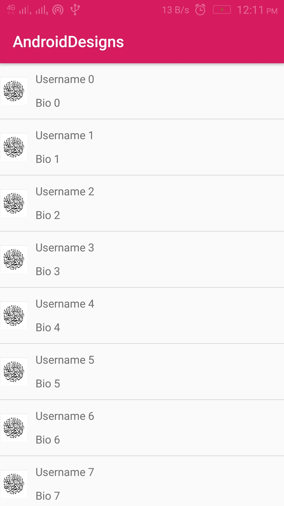 


```


#Recycler view horizontal scroll


```


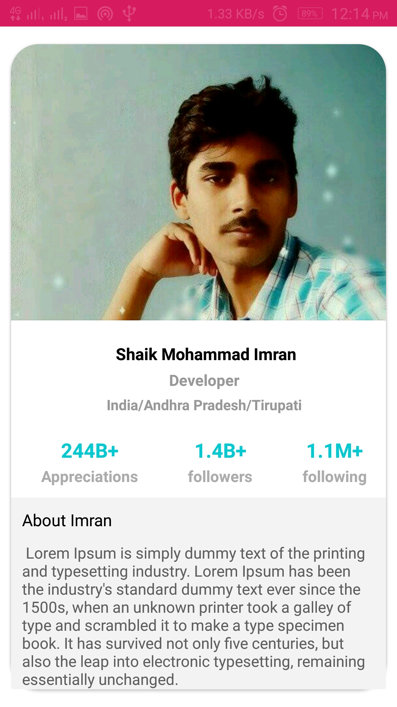 


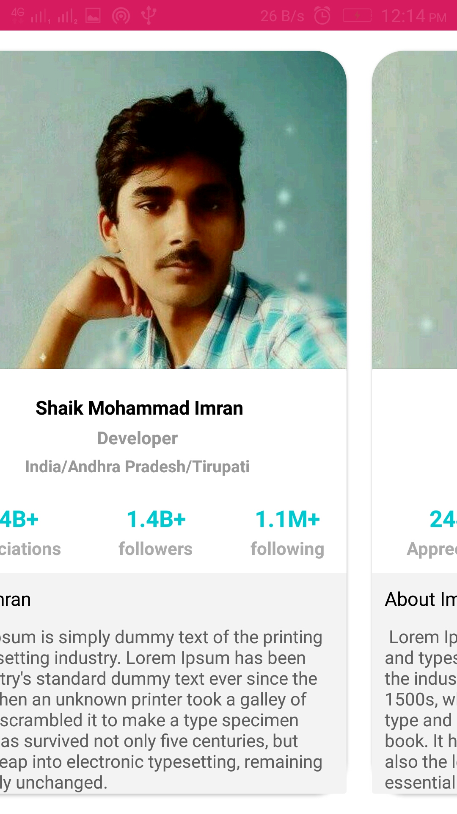 


```


#Grid layout


```


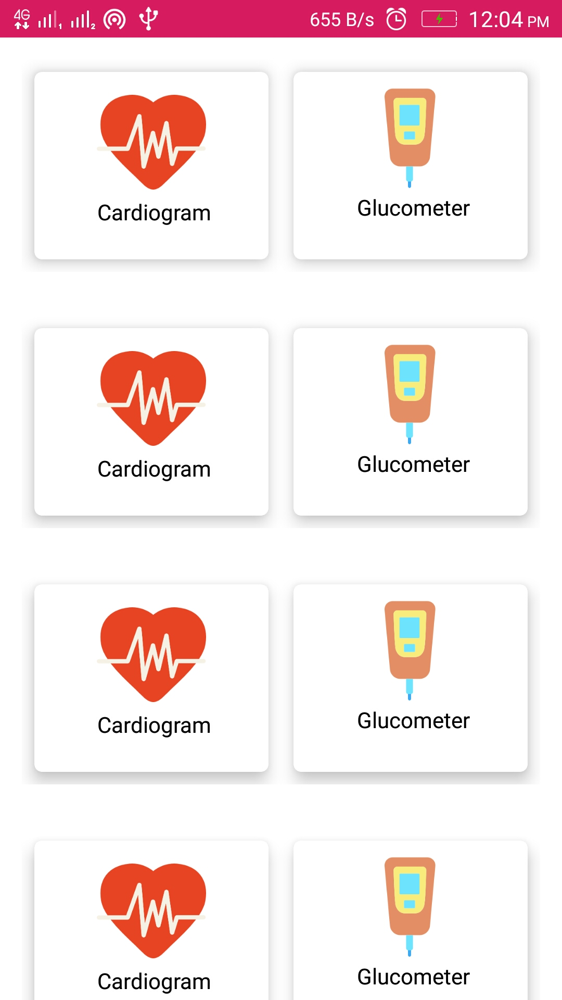 


```


#Button Desings


```


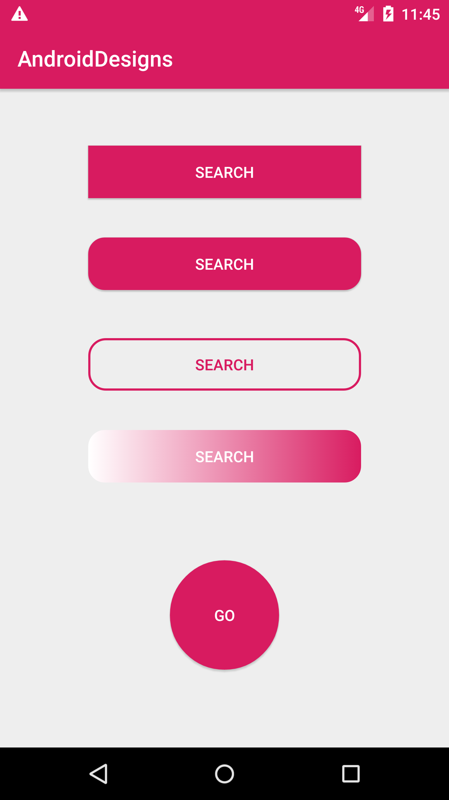 


```


#Stackview


```


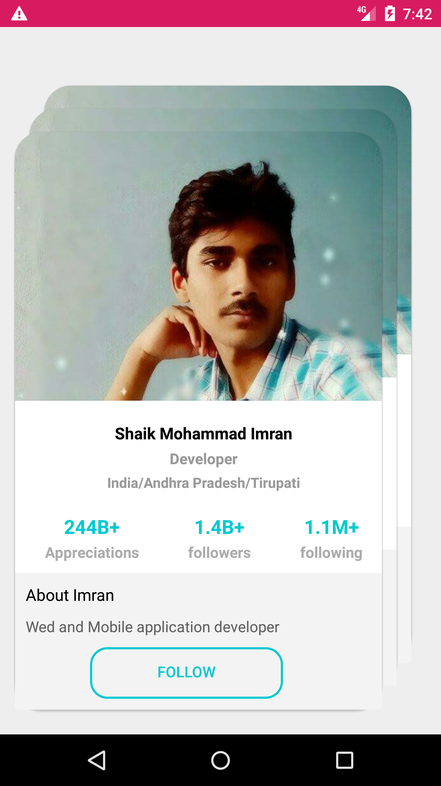


```


#Custome Progressbar


```


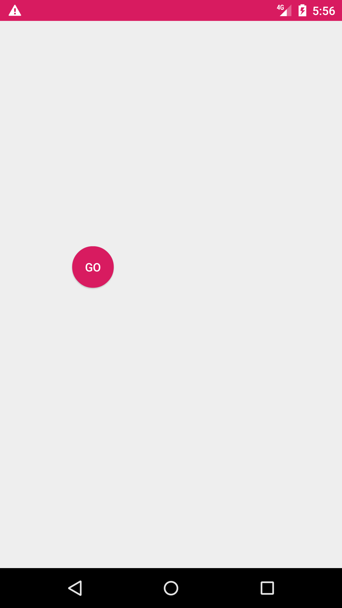


```


#lollipop Progressbar at 0% 25% 50% 100% 


```


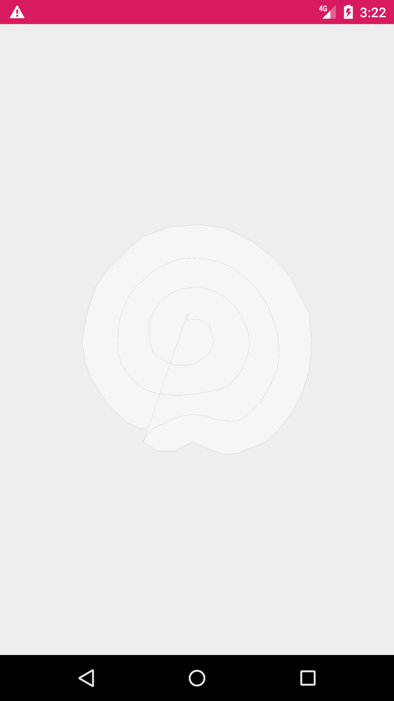


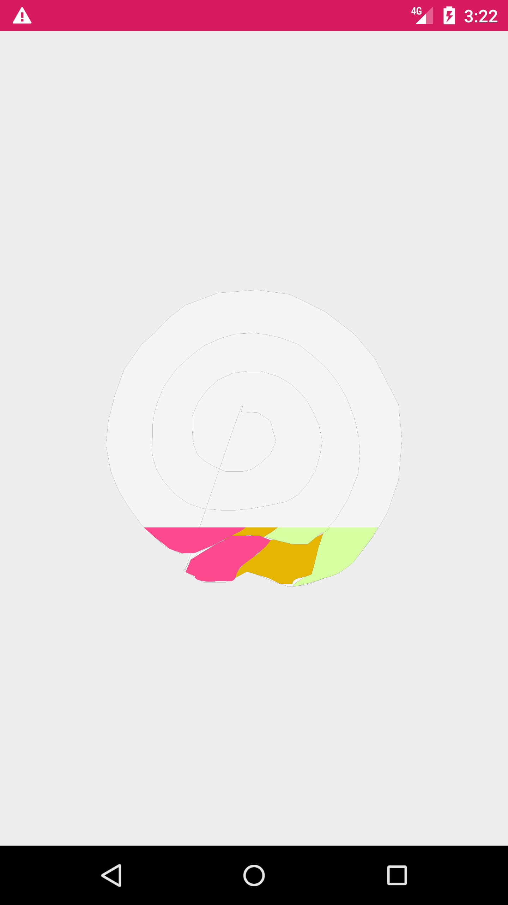


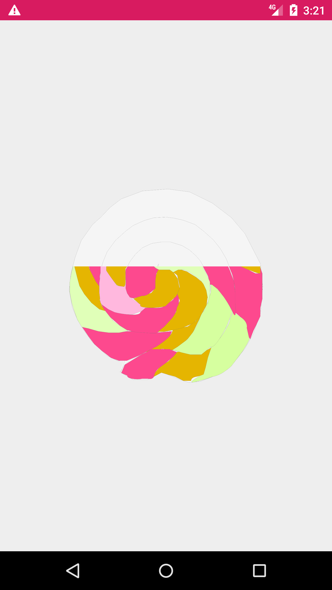


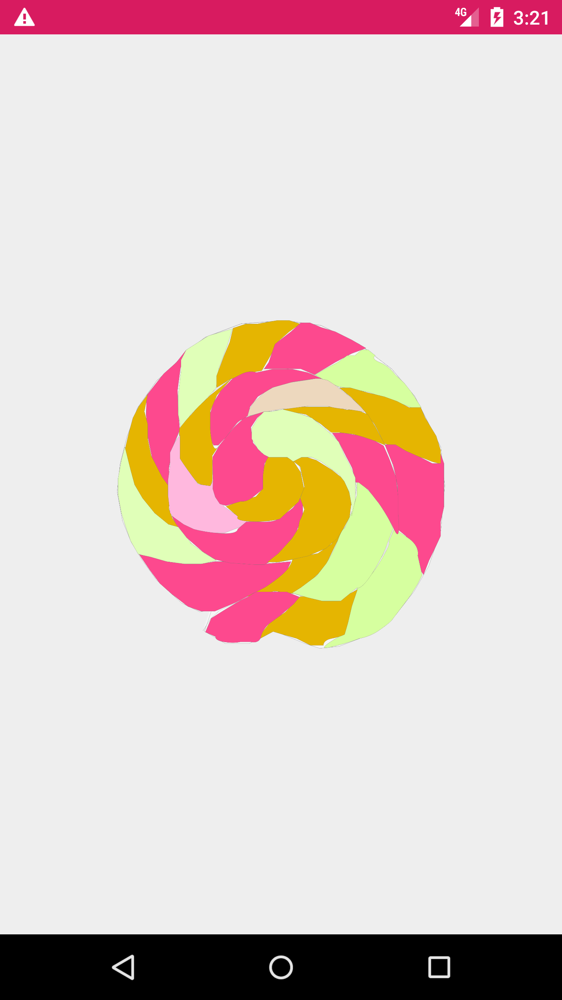


```


#Modern Bottom Navigation bar


```


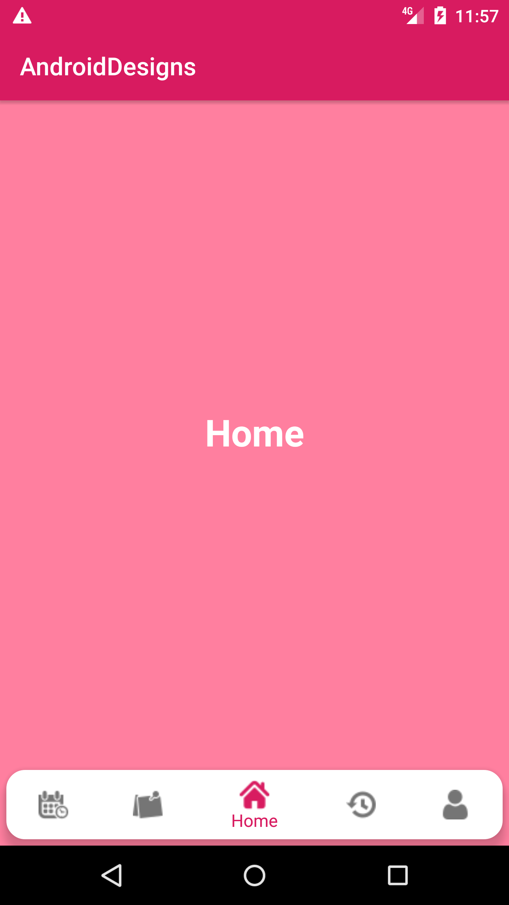
